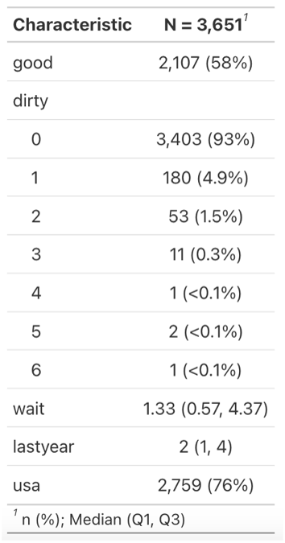
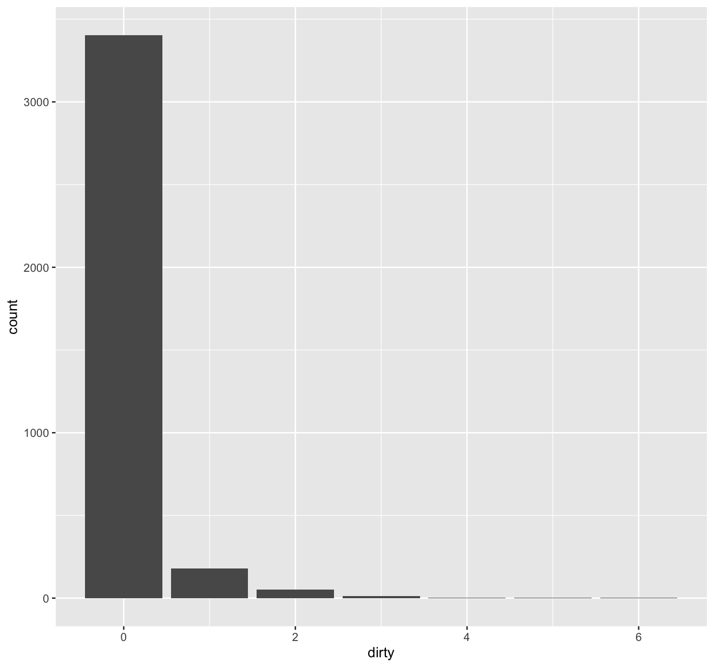
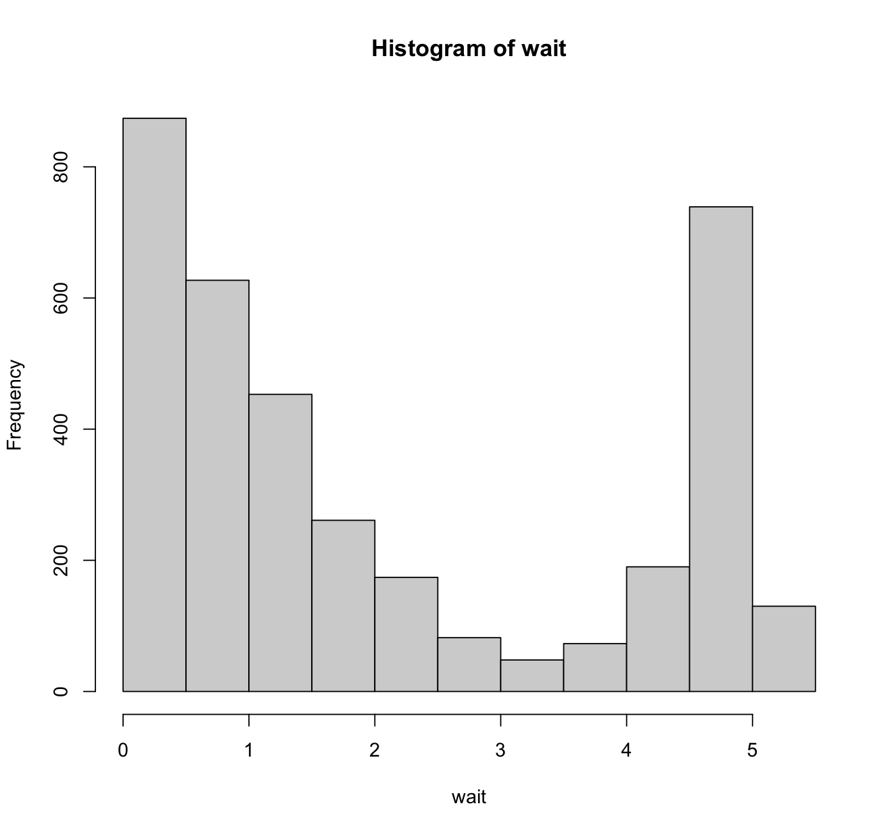
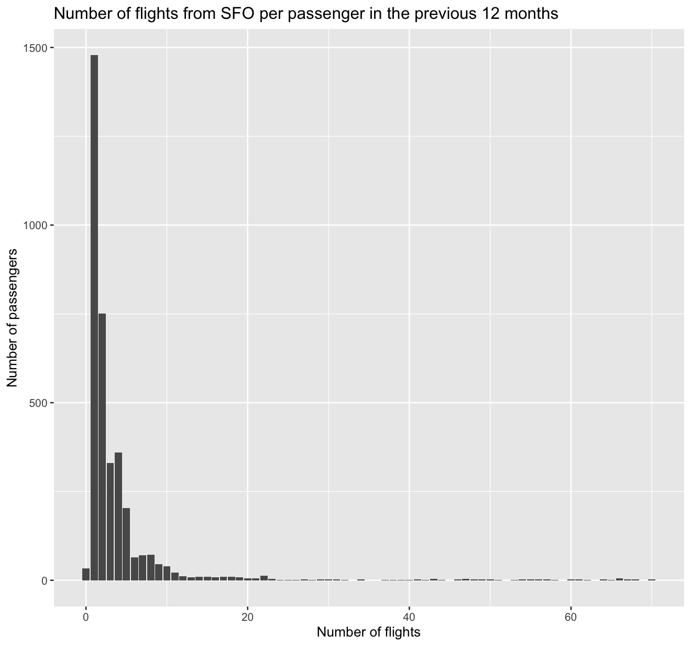
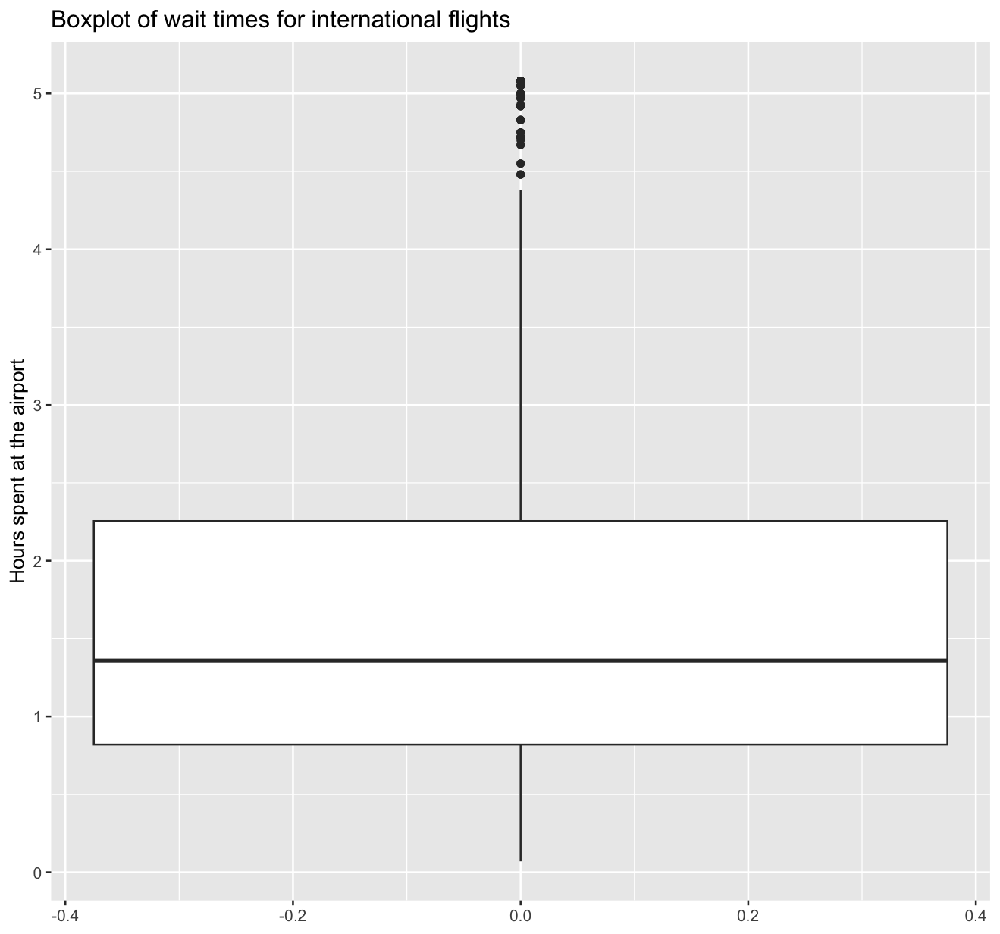

# Passenger Survey Analysis (R)

## Overview

This project analyses passenger survey data from San Francisco International Airport (SFO), with the aim of identifying the key factors that influence customer satisfaction.

The analysis is conducted in R, combining exploratory data analysis with logistic regression modelling.

## Dataset

The dataset includes survey responses covering:

- Perceived cleanliness of the airport  
- Time spent at the airport  
- Flight type (domestic or international)  
- Number of flights taken in the past year  
- Overall satisfaction (approval)

## Exploratory Analysis

Initial data exploration highlights key patterns in passenger behaviour and satisfaction.

### Summary Statistics

  

The median wait time is approximately 1.33 hours, with a wide spread between lower and upper quartiles, indicating varied passenger experiences.

### Cleanliness Perception

  

Most passengers reported that the airport was clean, with only a small proportion identifying dirty areas.

### Wait Time Distribution

  

The distribution of wait times is right-skewed, with a strong concentration at shorter durations, alongside a distinct secondary peak around 4.5–5 hours, suggesting a subset of passengers with much longer waiting times.
### Flights per Passenger

  

The majority of passengers had flown at least once in the previous year, indicating a largely experienced traveller base.

### International Wait Times

  

Wait times for international passengers appear more tightly distributed compared to the overall dataset.

## Methods

- Exploratory data analysis using visualisation and summary statistics  
- Logistic regression modelling using `glm()`  
- Model selection using Akaike Information Criterion (AIC)  

## Key Findings

- Cleanliness and wait time are the strongest predictors of passenger satisfaction  
- Flight type and travel frequency have limited impact  
- A simpler model using fewer variables performed best based on AIC  

## Project Structure

├── data/
├── scripts/
├── Plots/
├── report/
└── README.md

## How to Run

1. Open the R script in RStudio (or another R environment)  
2. Install required packages if needed  
3. Run the script to reproduce the analysis  

## Technologies Used

- R  
- dplyr  
- ggplot2  
- gtsummary  

## Author

Dipayan Chowdhury
